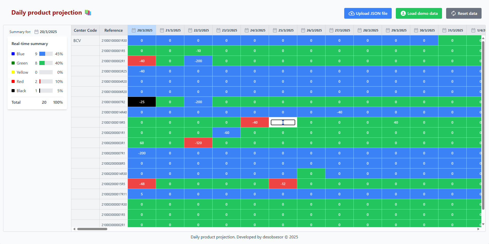

# Daily product projection 📚

A modern web application for visualizing and managing product projections, developed with React, TypeScript, Tailwind CSS, and a hexagonal architecture.

<p align="center">
  
</p>

<p align="center">
<a href="https://reactjs.org/" target="_blank"></a>
<a href="https://www.typescriptlang.org/" target="_blank"></a>
<a href="https://tailwindcss.com/" target="_blank"></a>
<a href="https://github.com/pmndrs/zustand" target="_blank"></a>
<a href="https://react-window.now.sh/" target="_blank"></a>
<a href="https://developer.mozilla.org/en-US/docs/Web/API/Web_Workers_API" target="_blank"></a>
<a href="https://github.com/GoogleChromeLabs/comlink" target="_blank"></a>
</p>

## Features📍

- **Projection Grid**: Visualization of product data in spreadsheet format with fixed columns for CenterCode and Reference.
- **Cell Editing**: Allows modification of MakeToOrder values with real-time cell color updates.
- **Visual Summary**: Displays color statistics with percentage bars.
- **Virtualization**: Uses react-window to efficiently handle large data sets.
- **Background Calculations**: Implements Web Workers for intensive operations without blocking the user interface.

## Technologies Used💡

- **React 19**: Modern UI framework
- **TypeScript**: Static typing for greater robustness
- **Tailwind CSS**: CSS utility framework for rapid design
- **Zustand**: Simple and effective state management
- **React-Window**: List virtualization for optimized performance
- **Web Workers**: Background processing for intensive calculations
- **Comlink**: Simplified communication with Web Workers

## Architecture 🗂️

The application follows a hexagonal architecture (also known as ports and adapters) that clearly separates:

- **Domain**: Core business logic and data types
- **Application**: Use cases and state management
- **Infrastructure**: Technical implementations like Web Workers
- **Presentation**: UI components and visualization

## How to Use 📦
To install and run the project, follow these steps:

1. **Clone git repository**:
   ```bash 
   git clone https://github.com/desobsesor/projection-grid-web.git
   ```

2. **Install Dependencies**:
   ```bash 
   npm install
   ```

3. **Start in Development Mode**:
   ```bash
   npm run start
   ```

4. **Load Data**:
   - Use the "Load JSON file" button to select a file with the appropriate format.
   - Alternatively, use "Load sample data" to test with example data.

5. **Interact with the Grid**:
   - Click a cell to edit the MakeToOrder value.
   - Observe how the cell color changes according to defined rules.
   - Click a date in the header to update the visual summary.

## Data Format 📌

The application expects a JSON file with the following structure:

```json
{
  "Data": [
    {
      "CenterCode": "BCV",
      "Reference": "210001000004R20",
      "VisibleForecastedDate": "2025-03-21T00:00:00",
      "NetFlow": 1513.0,
      "GreenZone": 121.768285,
      "YellowZone": 121.768285,
      "RedZone": 194.829256,
      "MakeToOrder": 0
    }
  ]
}
```

## Color Logic 🧪

The background color of each cell is determined according to the calculation `NetFlow + MakeToOrder`, compared to the ranges:

- **Red**: If `1 <= (NetFlow + MakeToOrder) <= RedZone`
- **Yellow**: If `RedZone < (NetFlow + MakeToOrder) <= RedZone + YellowZone`
- **Green**: If `RedZone + YellowZone < (NetFlow + MakeToOrder) <= RedZone + YellowZone + GreenZone`
- **Black**: If `(NetFlow + MakeToOrder) == 0`
- **Blue**: If `(NetFlow + MakeToOrder) > RedZone + YellowZone + GreenZone`

## Production Build 🛠️

```bash
npm run build
```
Compiled files will be available in the `dist` directory.

## Testing 🧪
To run the tests, execute the following command:
```bash
npm test
```

<h3>Test Coverage Guide</h3>
<p>For visual inspection of test coverage, please visit <a href="./coverage/lcov-report/index.html">Test Coverage</a> before building the project.</p>


## Author ✒️

_Built by_

- **Yovany Suárez Silva** - _Full Stack Software Engineer_ - [desobsesor](https://github.com/desobsesor)
- Website - [https://portfolio.cds.net.co](https://desobsesor.github.io/portfolio-web/)

## License 📄

This project is under the MIT License - see the file [LICENSE.md](LICENSE.md) for details
